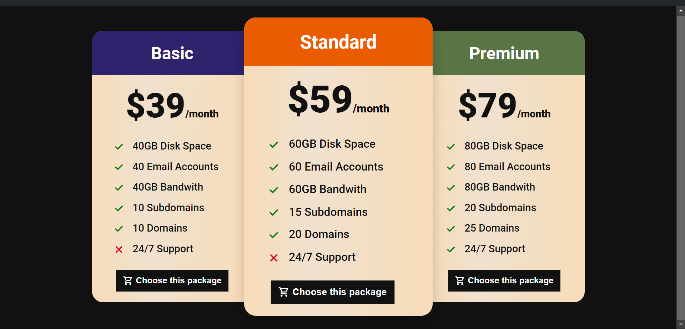

# Pricing Table With HTML and CSS

Ini merupakan simple project menggunakan HTML and CSS untuk membuat pricing table. Pricing table adalah sebuah representasi visual yang biasanya digunakan pada websites perusahaan untuk menampilkan berbagai macam rencana penjualan atau paket yang ditawarkan oleh perusahaan. Perusahaan sering menggunakan pricing tables untuk membuat pilihan produk dan layanan mereka lebih jelas, teratur, dan comparative, sehingga konsumen dapat lebih mudah membuat keputusan pembelian.

# Tools

## Screenshots

